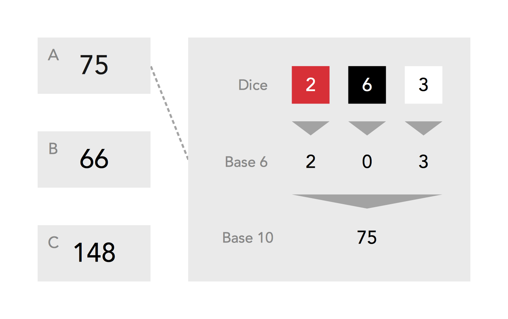
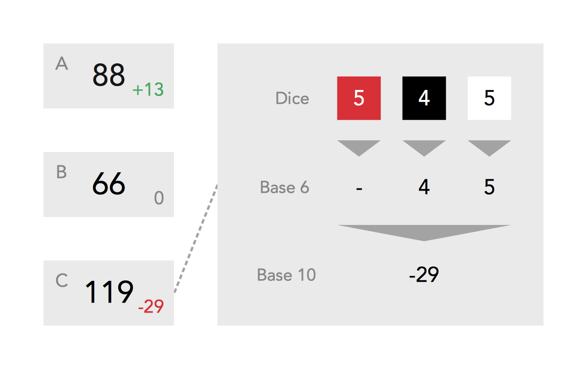

# Materials

- Paper
- Pencil
- Three dice of different colour
  - In this case, they will be red, black, and white
  - For the purposes of this game, all 6s rolled are 0s
-   Tokens for money (optional, could instead keep track on paper)

# Preparation

- Each player is to start with 900 dollarydoos.
- Game information may be tracked however you wish.

# Generation Phase

Generate the value of each stock that is out of play (value has reached 0).

1. This will be all stocks if you are currently starting a game.
1. This is done by rolling all three dice to generate a Base 6 number.
1. In the order of red, black, then white, a three-digit number will be formed.
  - Reroll if a value of 0 has been rolled.
  - Obviously, convert this to Base 10 for easier understanding.

Advance to the **Main Phase**.

# Main Phase

During each turn, the current player may purchase as many shares as they would like from as many stocks as they would like. They may not, however, repurchase shares sold the same turn.

*Additional Notes*

- Any shares that one wishes to sell may be sold at any time during *their* turn.
- One must buy at least three shares. This purchase may be distributed, however.

After all have had a turn, roll the dice three times to determine how the share value will change for the three different stocks.

- The red die will indicate whether the change is positive or negative
  - Even is positive, odd is negative
- The black and white dice (in that order) will form a two-digit number.
  - Obviously, convert this to Base 10 for easier understanding.

Any stocks have had their share value reduced to 0 or lower are to be removed from play. If so, return to the **Generation Phase**. Otherwise, repeat the **Main Phase**.

# Winning

In order to win the game, one must have the most amount of money (including the value of all owned shares) at the end of a set number of turns.

You will have instantly lost the game if you cannot afford to own three shares.

# Illustrations

Also viewable at http://imgur.com/a/JNqa8.

